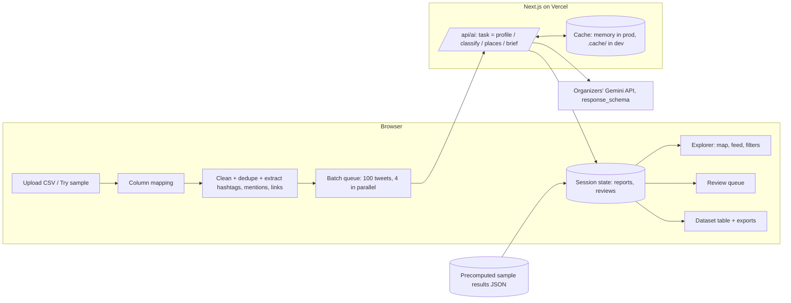

# Living Flood Map: system design v1

Challenge sponsor: CE Strategies (Thunder Bay / Winnipeg; GIS, mapping, First Nations community planning; software arm MapAki).
Goal: turn a CSV of disaster tweets into (A) a map-first explorer for communities and responders and (B) a reviewed, GIS-ready dataset for officials.

---

## 1. What the data tells us (profiled 8,024 rows)

| Finding | Number | What it means for the design |
|---|---|---|
| Columns | 1 (`tweet`) | No timestamp, author, tweet ID or geotag. "Where / when / who" must be extracted from text. |
| Event | 2013 Alberta floods | Matches the public CrisisLexT6 research set (6 events, ~10k tweets each, labelled on-topic / off-topic). The judges' unseen CSV is very likely another event from that family: Queensland floods, Hurricane Sandy, Oklahoma tornado, Boston bombings, West Texas explosion. **Nothing may be hard-coded to floods or Alberta.** |
| Exact duplicates | 462 | Classify once, copy to the group. |
| Retweets | 2,225 | Strip `RT @x:`, keep as "echo count" (amplification signal). |
| Unique after normalizing RT + links | 7,470 | This is the real AI workload. |
| Noise | #job, #hiring, Canada Day, sports, celebrities | Relevance is a real task, not a formality. Spam using the event hashtag = unrelated. |
| Place mentions | Calgary 1,672 · Edmonton 201 · downtown 159 · Stampede 126 · Mission 110 · High River 99 · Siksika 77 · Saddledome 69 · Canmore 55 · Medicine Hat 45 · Bowness 33 · Inglewood 31 | Many places are mentioned without being flooded (Edmonton sends help, comments). We need a **place role**: affected / help coming from / just mentioned. Ambiguous names exist (Mission = Calgary neighbourhood, also Mission BC). |
| Time words | ~724 tweets, mostly relative ("tonight", "Friday") | "When" = time as written + type (now / past / forecast). Real time slider only if an uploaded CSV has a timestamp column. |
| First Nation terms | ~104 tweets (Siksika, Stoney/Morley, Tsuut'ina, "reserve") | A first-class filter and export column, given the sponsor's work. |
| Literal `\n`, `&amp;`, t.co links | common | Deterministic cleaning before AI. |

---

## 2. Product in one line

Drop in a CSV of tweets. The app works out what the disaster is, sorts real reports from noise, pins each report where it happened, and lets a reviewer confirm everything before it becomes an exportable map layer.

## 3. Two deliverables, one approval gate at the end

| | Deliverable A: Explorer | Deliverable B: Exportable dataset |
|---|---|---|
| For | Community members, chief and council, emergency coordinators | Officials, CE Strategies GIS team, judges |
| Shape | Map + report feed + filters + AI situation brief | In-app table + exports: CSV, XLSX (with data dictionary), GeoJSON |
| Trust | Every AI field shows confidence and its source words; anyone can flag or correct in place | Every row carries review status and correction history; the export is stamped with who published it |

GeoJSON is the bridge the challenge asks for: it drops straight into the GIS layers and MapAki tools decision-makers already use.

### Trust model

During a flood, latency is the harm. A queue of reports waiting for someone to tick "approve" means the map is always behind the water. So the map is live, and the gate sits where data leaves the tool.

**Results appear immediately.** Every tweet the model sorts as related is plotted as its batch finishes. There is no tweet-by-tweet approval and no holding queue.

**Confidence drives pin style,** so the map states its own reliability without anyone grading it first:

| Confidence | Pin style | Reading |
|---|---|---|
| High | Solid fill, full opacity | Place named plainly, role unambiguous |
| Medium | Outlined, no fill | Plausible, worth a look, not confirmed |
| Low | Dimmed to 30%, hidden by default behind a "show low confidence" toggle | Guesswork, visible only if the user asks |

**The situation brief renders immediately,** labelled **"AI-generated"** with a timestamp and cited report IDs. Nobody approves it before it appears. It is a reading aid, not a record.

**Correction happens in real time, by anyone:**
- **Flag** a pin: not related / wrong place / duplicate. It dims and leaves the default view instantly, no round trip.
- **Correct** a pin: drag it, or fix the place name or category. The edit is attributed and takes effect at once.

Flags and corrections are written to the row, so the export carries the community's fixes, not only the model's guesses.

**The one approval gate is the export.** Nothing becomes a GIS artifact without a named human clicking Publish once (sections 6 and 8).

> This relaxes the kit's default "nothing is saved or acted on without human approval" for *display only*. The map is a view; nothing is sent or acted on. The approval requirement is kept exactly where it bites: the GeoJSON leaving the building.

---

## 4. Architecture



Decisions:
- **No database.** Uploaded data lives in the browser session only. Simpler, faster, and the right default for community data (see section 9).
- **Browser drives the batching.** Each server call is short (one batch), so no Vercel timeouts, and the user sees live progress as reports stream onto the map.
- **Sample dataset is precomputed** through the cache once and shipped as static JSON. Demo and first judge click cost zero credits and load instantly.
- **Vercel's filesystem is not writable** outside `/tmp`, so the `.cache/` file cache is dev-only. In production: in-memory cache plus the precomputed JSON.

---

## 5. Pipeline

| Stage | What happens | AI? | Calls (this dataset) |
|---|---|---|---|
| 0. Ingest | Parse CSV. Auto-detect text column (`tweet`, `text`, `tweet_text`, `content`, `message`, else longest string column). Optional: id, timestamp, author, lat/lon, label. Show preview; user confirms mapping. | No | 0 |
| 1. Clean | Decode entities, fix literal `\n`, split `RT @x:` into `retweet_of`, pull hashtags / mentions / links, group duplicates. | No | 0 |
| 2. Event brief | 150 sampled tweets + top hashtags → event type, name, region, country, rough bounding box, key hashtags, key places, what counts as "related". Shown as an editable **Draft event brief**; user clicks "Confirm event and sort tweets". Feeds every later prompt. | Yes | 1 |
| 3. Sort & extract | Batches of 100 unique tweets → per-tweet fields (section 7). Retry once; failed batches marked, resumable. | Yes | ~75 |
| 4. Place resolution | Collect unique normalized places (expect 100–300). AI returns lat/lng + precision + inside-region check, biased by the event bounding box. Optionally verify the top 20 with Nominatim (1 req/s max, cached). Outside-region or low-confidence places go to review. | Yes | 1–3 |
| 5. Explore | Filters, search, map layers: all client-side. | No | 0 |
| 6. Situation brief | On click: top ≤200 reports in the current filter → short brief (where it's worst, roads/bridges out, evacuations, needs, First Nations communities) with cited report IDs. Labelled Draft. Cached per filter. | Yes | 1 per click |
| 7. Review & export | Human confirms / corrects; export. | No | 0 |

**Fallback mode:** if the API errors or the quota runs out, a keyword scorer (event-brief hashtags + generic crisis lexicon) sorts tweets and the app shows "Quick sort, not AI checked". The app never dead-ends in front of a judge.

---

## 6. Deliverable B: cleaned dataset columns

Main sheet = related reports only. Each column says how it was made: **R** rule, **AI** model, **H** human.

| Group | Column | Example | Made by |
|---|---|---|---|
| Identity | `report_id`, `source_row` | R-00412, 1071 | R |
| | `text` (original), `clean_text` | | R |
| | `is_retweet`, `echo_count` | true, 14 | R |
| | `hashtags`, `link_count` | #yycflood #abflood | R |
| Relevance | `relevant` | yes | AI → H |
| | `relevance_confidence` | high / medium / low | AI |
| | `relevance_reason` (≤12 words) | Reports flooding on 17th Ave | AI |
| What | `category` | Road or bridge closed | AI → H |
| | `urgency` | Act now / Useful info / Background | AI → H |
| | `firsthand` | yes (eyewitness) | AI |
| | `needs` | sandbags, volunteers | AI |
| Where | `place_text` (exact words from tweet) | "17th Avenue" | AI |
| | `place_name`, `place_type` | 17 Ave SW, Calgary · street | AI |
| | `place_role` | affected / help from / mentioned | AI |
| | `lat`, `lng`, `location_precision` | 51.038, -114.07 · street | AI + geocoder → H |
| | `first_nation_community` | Siksika Nation | AI |
| When | `time_text`, `time_type` | "last night" · past | AI |
| | `posted_at` | only if the upload had timestamps | R |
| Who | `who_affected` | seniors in Bowness | AI |
| | `source_type` | resident / official / media / organization / unknown | AI |
| Trust | `review_status` | **defaults to `AI draft`** → flagged / corrected / published | AI → H |
| | `flag_reason`, `corrected_by`, `changed_fields` | wrong place · null · [`lat`,`lng`] | H |
| | `reviewed_by`, `reviewed_at` | filled once, on Publish | H |
| | `model`, `processed_at` | | R |

**`AI draft` is a live state, not a holding state.** Every row starts there and is on the map at that status, styled by confidence (section 3). It means "shown, model-sourced, not yet signed off". Rows move to `flagged` or `corrected` the moment a user acts on them, and to `published` on export.

**Export requires one analyst to click Publish.** No row needs individual review, and there is no second approver.

**Categories** (generic so they work for any disaster; the event brief can rename them):
Flooding or damage · Road or bridge closed · Evacuation or shelter · People needing help · Official warning or update · Power, water and services · Donations and volunteers · Support and sympathy · Other related.

**XLSX sheets:** Reports · Excluded (count + reasons, for audit) · Data dictionary · Run info (event brief, model, counts, reviewer, accuracy if labels were present).
**GeoJSON:** one Point per located report, properties = the columns above.

---

## 7. AI design

- Model: `gemini-3-flash-preview` via the organizers' endpoint, `response_schema` for all outputs, low temperature.
- Every prompt receives the confirmed event brief.
- Compact per-tweet schema (short keys keep 100 results per call affordable):

```ts
{ i: number,                 // index in batch
  rel: boolean, conf: "h"|"m"|"l", why?: string,   // why only when conf != "h"
  cat: Category, urg: "act"|"info"|"bg", eye: boolean,
  places: { text: string /* exact substring */, name: string,
            type: PlaceType, role: "affected"|"help_from"|"mentioned" }[],
  time?: { text: string, type: "now"|"past"|"forecast" },
  who?: string, needs?: string[], src: SourceType, fn?: string }
```

Prompt rules that matter:
- Judge relatedness to **this event**, by content. The hashtag alone is not enough; spam and job ads using the event hashtag are unrelated.
- `places[].text` must be copied exactly from the tweet (this powers the highlighted evidence). Hashtag places count (#yyc → Calgary, #highriver → High River) with lower precision.
- Never invent a place that isn't in the text. No coordinates in the classify call.
- Validate every response with zod; drop invalid items to review rather than guessing.

**Accuracy we can prove:** CrisisLexT6 publishes the on-topic / off-topic labels for this event. Join by text, score a 500-tweet sample, put precision / recall in the README and video. In the app: if an uploaded CSV has a label column, it is hidden from the AI and the app shows "Agreement with your labels: 91%". Strong move for the unseen-dataset test.

**Credit budget (requests):**

| Use | Calls |
|---|---|
| Process this dataset once (precompute) | ~80 |
| Prompt tuning on 3–5 small samples | ~15 |
| Each judge upload of ~10k tweets | ~80–100 |
| Situation briefs during demo and judging | ~20 |
| **Plan for** | **~300** |

If the quota is tighter: batch size 200, and skip AI for exact duplicates and pure retweets of already-sorted tweets.

---

## 8. Screens

1. **Start.** Drop a CSV or "Try the Alberta 2013 floods sample". Column preview and mapping. Line: "Your file stays in this browser. Nothing leaves the tool until you publish."
2. **Event brief (Draft).** Editable card: event, region, key hashtags, what counts as related. Button: "Confirm event and sort tweets".
3. **Sorting.** Stage words ("Reading 7,470 tweets", "Finding places", "Placing reports on the map"), live counters, reports appear as batches finish.
4. **Explorer (hero screen, fits 1440×900).** Map ~60% left, panel right with tabs Reports / Situation brief. Reports land on the map as batches finish, with no approval in between. Filter bar: category, urgency, eyewitness only, place or community, confidence, review status, search, plus a "show low confidence" toggle (off by default). Pins clustered, coloured by category with icon + word, and **styled by confidence per section 3: solid, outlined, or dimmed.** Click a pin → report card: original tweet with `place_text` highlighted, structured fields beside it, confidence on each, and two always-available actions, **Flag** and **Correct** (drag the pin or fix the place). Both apply instantly. The Situation brief tab renders on open under an **"AI-generated"** label and timestamp. This is the one memorable moment from DESIGN.md.
5. **Corrections (not a gate).** A log, not a queue: what has been flagged and corrected, by whom, newest first, with undo. Optional "needs a look" filter surfacing low-confidence and outside-region pins for anyone who wants to tidy them, but the map never waits on it.
6. **Dataset.** Sortable table, same filters, exports: CSV, XLSX, GeoJSON. One **Publish** button. It opens a single dialog naming what is going out ("428 related pins · 31 flagged and excluded · 12 corrected"), takes the analyst's name once, and downloads. The export is stamped `reviewed_by`, `reviewed_at`, source filename and row count, `model`, `prompt_version`, and the flagged / corrected counts, so the receiving GIS layer knows the map was touched. Flagged rows are excluded by default and listed in the Excluded sheet. No per-row checklist, no second approver. If nobody publishes, nothing persists.

Honest limit shown in the UI: "This file has no timestamps, so the map shows where reports concentrate, not how they spread over time." With a timestamp column, a time slider appears.

---

## 9. Privacy, data sovereignty, trust

- Respect OCAP (Ownership, Control, Access, Possession), the First Nations principles for community data. Say it in the video; CE Strategies works under it.
- No database; uploads stay in the browser session. Only tweet text goes to the AI. Nothing is stored server-side beyond the in-memory cache.
- Personal @handles replaced with `@user` in exports by default (toggle to keep, for agencies).
- A home-level location (street address of a private house) is rounded to street or neighbourhood precision on the map.
- Map pins labelled "Community report, not verified" until confirmed.
- Excluded tweets remain auditable (Excluded sheet), matching XPawn's auditable-AI stance.

---

## 10. Stack and dependencies to approve

Existing: Next.js, Tailwind, shadcn/ui, lucide-react, zod, sonner.
Add (ask before installing, per CLAUDE.md):
- `papaparse`: CSV parsing, handles quoted commas.
- `leaflet`, `react-leaflet`, `leaflet.markercluster`: map; load with `next/dynamic` and `ssr: false`. Calm light basemap (CARTO Positron or OSM), attribution shown.
- `xlsx` (SheetJS): XLSX export. Cut first if short on time; CSV + GeoJSON cover the requirement.

`src/lib/ai/`: `prompts.ts` (profile, classify, places, brief), `schema.ts` (zod per task), `client.ts`.
`src/lib/pipeline/`: `ingest.ts`, `clean.ts`, `batch.ts`, `fallback.ts`, `export.ts`.
`mocks/`: `profile.json`, `classify.json` (100 realistic items), `places.json`, `brief.json`.
`public/sample/alberta-2013.json`: precomputed results.

---

## 11. Build order (fits the kit's schedule)

| Slice | By | Done when |
|---|---|---|
| 1 | ~11:00 | Upload → mapping → clean/dedupe → mocked sort → feed + table → CSV export |
| 2 | ~12:30 | Map with pins and clusters, filters, event brief card, review queue, report card with highlighted evidence |
| 3 | 12:30–2:00 | Live AI, place resolution, situation brief, GeoJSON (+ XLSX), precompute sample, accuracy score, fallback mode |

Cut list if behind (in order): Nominatim verification, XLSX, bulk confirm, heat layer, handle toggle.

---

## 12. Risks

| Risk | Mitigation |
|---|---|
| Quota / rate limits unknown | Ask organizers now; batch 100–200; precompute sample; fallback mode |
| Judges' CSV has other columns or event | Column auto-detect + preview; event brief step; generic categories; test on a second CrisisLexT6 event if time |
| Wrong pins (Mission BC vs Calgary) | Event bounding box; outside-region → review; precision shown |
| Mentioned ≠ affected (Edmonton) | `place_role`; map shows "affected" by default |
| Vercel timeouts / big uploads | Browser-driven batches; cap at 20k rows with a clear message |
| `.cache/` fails on Vercel | Memory cache in prod, file cache in dev only |

---

## 13. Demo story (90 seconds)

Open with the WHY (Kashechewan, Peguis). Load the sample. The event brief appears; confirm. Reports stream onto the map. Filter to "Evacuation or shelter" + First Nations → Siksika Nation reports surface; click one, the words that placed it are highlighted. Generate a situation brief. Fix one wrong pin in Review. Approve and export GeoJSON: "this is now a layer in your GIS". Close on accuracy against the public labels.

---

## 14. Questions for the organizers (ask at 8:30)

1. Request quota per team, rate limit per minute, max tokens per request?
2. Does `response_schema` accept an array of ~100 objects?
3. Will the judges' CSV have the same single `tweet` column? Any timestamps or labels?
4. Rubric weights (accuracy vs design vs usefulness)?
5. Any CE Strategies / MapAki brand assets we may use?
